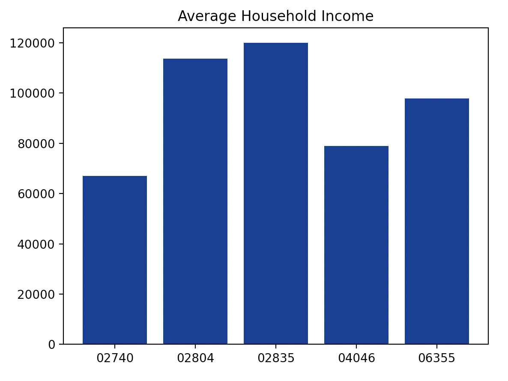
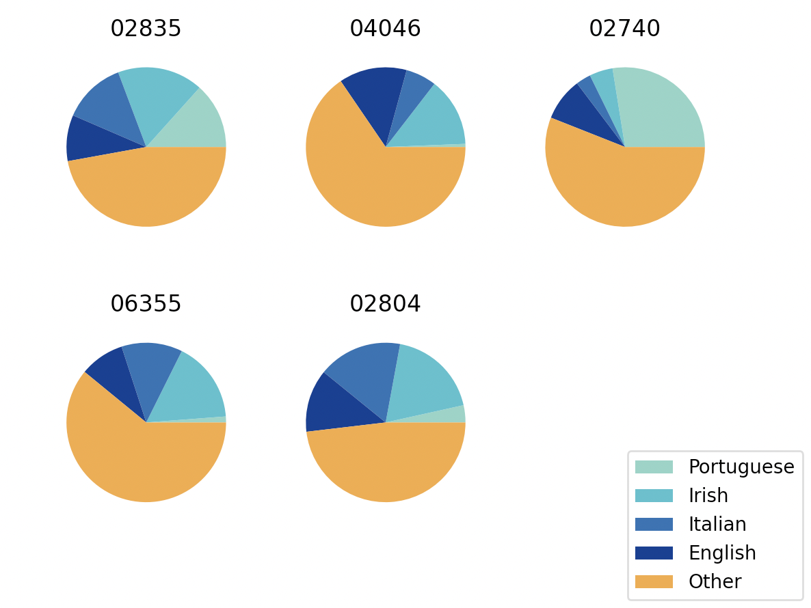

Example using ipumspy
=====================

Ziptool can be used with downloaded CSV files of ACS data, but it works best
with ipumspy, a Python package that uses your IPUMS API key to pull data directly.
The example below details a sample use case of ziptool for basic demographic
research using ipumspy and both implementations of data_by_zip.

In this example, we want to explore various demographic traits of five coastal
New England towns throughout the region: Jamestown, RI (02835); Kennebunkport,
ME (04046); New Bedford, MA (02740); Stonington, CT (06355); and Westerly, RI
(02804). We are particularly interested in household income and ancestry.

Setup
-----
First, import pandas, numpy, and some other important dependencies.
::

    import pandas as pd
    import numpy as np
    from pathlib import Path

We give two options for pulling data. Using ipumspy is recommended as it is much
easier to use, but importing CSVs is fully supported as well.

Option 1: Manually Pulling Data
-------------------------------
1. Go to https://usa.ipums.org/usa/ and create a free account.
2. Click the "Select Data" tab.
3. Click "Select Samples" to select the year of ACS data you are interested in
 (ziptool only supports one year at a time).
4. Under the "Select Harmonized Variables" dropdown, choose the variables you
would like. Be sure to add "PUMA" and "STATEFIP" under the Household ->
Geographic tab
5. Hit "View Cart" then select "Create Data Extract." Select .csv as the data
format and rectangular under structure.
6. Hit submit extract and wait until it is finished so you can download!

Once you have the data downloaded, simply pass the path to the CSV as an argument
in data_by_zip. Ziptool will handle the import for you.

The rest of the tutorial will use the ipumspy option because of its ability
to import and parse the associated codebook, which we need in this example.

Option 2: Pulling Data with ipumspy
-------------------------
Import ipumspy and the modules we need explicitly.
::

    import ipumspy
    from ipumspy import IpumsApiClient, UsaExtract, readers, ddi

Then, using the API key, we request the variable we are interested in ('HHINCOME'
and 'ANCESTR1') along with 'PUMA' and 'STATEFIP', both of which are required
variables for usage with ziptool. We also would like to get data from the 2019
ACS, which is labeled in ipums as 'us2019a'. The request is then submitted and
downloaded (note that this can take quite a while depending on how many variables
you request.)
::

    IPUMS_API_KEY = your_api_key
    DOWNLOAD_DIR = Path(your_download_dir)

    ipums = IpumsApiClient(IPUMS_API_KEY)

    extract = UsaExtract(
        ["us2019a"],
        ["STATEFIP","PUMA","HHINCOME","ANCESTR1"],
    )
    ipums.submit_extract(extract)
    ipums.wait_for_extract(extract)
    ipums.download_extract(extract, download_dir=DOWNLOAD_DIR)

Continuous Variables
--------------------

Now all the data needed for analysis is downloaded, and we can read it in as
a pd.DataFrame along with the codebook that contains the information associated
with each variable so that we can properly conduct our analysis.

::

    ddi_file = list(DOWNLOAD_DIR.glob("*.xml"))[0]
    ddi = ipumspy.readers.read_ipums_ddi(ddi_file)

    ipums_df = ipumspy.readers.read_microdata(ddi,
                DOWNLOAD_DIR / ddi.file_description.filename)

In this example, we want to analyze two different traits for these communities:
mean household income and reported ancestry. The former is a numerical ratio
variable whereas the latter is categorical. That means that we can take advantage
of ziptool's built-in analysis functions for HHINCOME but will read in the raw
data for the categorical data of 'ANCESTR1'. We import the relevant modules of
ziptool, data_by_zip (which will calculate the ZIP-level data) and convert_to_df
(which will convert the returned data into a pd.DataFrame for easier analysis).
Because we only want to analyze HHINCOME using summary statisticcs, we pass
*only* 'HHINCOME' as a variable of interest. The null value comes from the
codebook, as does the type (household vs. individual variable).

::

    from ziptool.query_by_zip import data_by_zip
    from ziptool.utils import convert_to_df

    income_data = data_by_zip(['02835','04046','02740','06355','02804'], ipums_df,
        {"HHINCOME": {"null": 9999999, "type":'household'}})
    income_df = convert_to_df(income_data)

We now have a pd.DataFrame that contains all of our data! We can easily generate
a bar plot to visualize differences by income as an example of the easy analysis
that we can now perform.

::

    import matplotlib.pyplot as plt
    ylgnbu = ['#7fcdbb', '#41b6c4', '#225ea8',
              '#0c2c84', '#f29c33', '#666462']
    #defining our colorscale

    plt.bar(income_df.index, income_df['HHINCOME_mean'], color = ylgnbu[3])
    plt.title('Average Household Income')
    plt.show()

Categorical Variables
---------------------

Categorical variables like ANCESTR1 are not usefully summarized by summary
statistics, so in this case, we can read in the raw data and perform our own
analysis. We do this by simply not specifying any variables:

::

    raw_dfs = data_by_zip(['02835','04046','02740','06355','02804'], ipums_df)

We are particularly interested in four ancestral groups that often formed much
of the populations of some coastal New England towns in the late 1800s : people of
Portuguese, Irish, Italian, and English ancestry. However, countries are encoded
as numbers in 'ANCESTR1' fron the ACS, so we must access the codebook to pull
out the codes corresponding to the ancestries we are interested in.

::

    ancestry_info = ddi.get_variable_info('ANCESTR1')
    ancestry_codes = ancestry_info.codes
    top_codes = [ancestry_codes['Portuguese'],
                 ancestry_codes['Irish, various subheads,'],
                 ancestry_codes['Italian'],
                 ancestry_codes['English']]

We can now plot a pie chart of each ZIP code's ancestry demographics:

::

    fig, ax = plt.subplots(2,3)

    for i,zip in enumerate(['02835','04046','02740','06355','02804']):
        row = int(np.floor(i/3))
        column = int(i % 3)
        data = raw_dfs[zip]
        ancestry_data= data.groupby('ANCESTR1').sum()['PERWT']
        other = pd.Series([ancestry_data.loc[~ancestry_data.index.isin(top_codes + [ancestry_codes['Not Reported']])].sum()],index=[0])
        to_plot = ancestry_data[top_codes].append(other)
        ax[row,column].pie(to_plot, colors = ylgnbu)
        ax[row,column].set_title(zip)

    ax[1,2].axis('off')
    fig.legend(['Portuguese','Irish','Italian','English','Other'], loc = 4)
    plt.show()

And just like that, we have analyzed our categorical variable! You can manipulate,
analyze, and visualize display data like you normally would with the ZIP-level
data in a standard pd.DataFrame!
