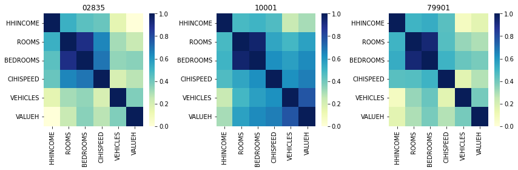

Example 2
=====================

Here, we are interested in comparing the correlations between different household
variables for different variables. We will use ipumspy and ziptool to easily
extract this data and generate correlation matrices.

Setup
-----
First, import pandas, ziptool, ipumspy and some plotting mechanisms.
::

    import sys
    from configuration import *
    import pandas as pd
    from pathlib import Path
    import matplotlib.pyplot as plt
    import seaborn as sns
    import ipumspy
    from ipumspy import IpumsApiClient, UsaExtract, readers, ddi

    from ziptool.query_by_zip import data_by_zip

First, we pull our data using ipumspy.

Fetching Data
-------------

Using our API key, we request the variables we are interested in (a selection
of household dwelling and economic indicators) along with 'PUMA' and 'STATEFIP',
both of which are required variables for usage with ziptool. We also would like
to get data from the 2019 ACS, which is labeled in ipums as 'us2019a'. The
request is then submitted and downloaded (note that this can take quite a while).

::

    IPUMS_API_KEY = your_api_key
    DOWNLOAD_DIR = Path(your_download_dir)

    ipums = IpumsApiClient(IPUMS_API_KEY)

    extract = UsaExtract(
        ["us2019a"],
        ["STATEFIP","PUMA","HHINCOME","ROOMS","BEDROOMS", \
         "CIHISPEED","FUELHEAT","VEHICLES","VALUEH"],
    )
    ipums.submit_extract(extract)
    ipums.wait_for_extract(extract)
    ipums.download_extract(extract, download_dir=DOWNLOAD_DIR)

Analyzing The Data
------------------

Now all the data needed for analysis is downloaded, and we can read it in as
a pd.DataFrame along with the codebook that contains the information associated
with each variable so that we can properly conduct our analysis.

::

    ddi_file = list(DOWNLOAD_DIR.glob("*.xml"))[0]
    ddi = ipumspy.readers.read_ipums_ddi(ddi_file)

    ipums_df = ipumspy.readers.read_microdata(ddi,
                DOWNLOAD_DIR / ddi.file_description.filename)

First, we define the null values of each of our variables (obtained from the
IPUMS online codebook).

::

    HHINCOME_null = 9999999
    BEDROOMS_null = 0
    ROOMS_null = 0
    CHISPEED_null = 0
    FUELHEAT_null = 0
    VEHICLES_null = 0
    VALUEH_null = 9999999

Then, we define a function called compare_variables which takes in a list of zip codes
and computes / plots the cross-correlation matrix between each variable of interest.
We first use ziptool's data_by_zip function to return the raw dataframes for each
ZIP code (we do not want any intermediate analysis or summary statistics) and remove the
null values for each zip code; we then pre-process the CIHISPEED variable to transform
it from a categorical variable to a binary variable (i.e. does a household have
broadband access, not what kind). Then, we generate a heatmap and plot!

::

    def compare_variables(zips):

        fig, axes = plt.subplots(1,len(zips), figsize = (12,4))

        df = data_by_zip(zips, ipums_df)

        for index, (zip, value) in enumerate(df.items()):

            mask = [value["BEDROOMS"] > BEDROOMS_null] and [value["ROOMS"] > ROOMS_null] and \
            [value["CIHISPEED"] > CHISPEED_null] and [value["FUELHEAT"] > FUELHEAT_null] and \
            [value["VEHICLES"] > VEHICLES_null] and [value["VALUEH"] != VALUEH_null] and \
            [value["HHINCOME"] != HHINCOME_null ]

            filtered = value[mask[0]]

            oneperson = filtered[filtered['PERNUM'] == 1]
            oneperson['CIHISPEED'] = oneperson['CIHISPEED'].replace(20,0)
            oneperson['CIHISPEED'] = oneperson['CIHISPEED'].replace([10,11,12,13,14,15,16,17],1)

            sns.heatmap(oneperson[["HHINCOME","ROOMS","BEDROOMS","CIHISPEED","VEHICLES","VALUEH"]].multiply(oneperson['HHWT'],axis = 'index').corr(), cmap = 'YlGnBu', vmin = 0, vmax = 1, ax = axes[index])
            axes[index].set_title(zip)

        plt.tight_layout()

We now have a pd.DataFrame, income_data, that contains all of our data! We can easily generate
a bar plot to visualize differences by income as an example of the easy analysis
that we can now perform.

