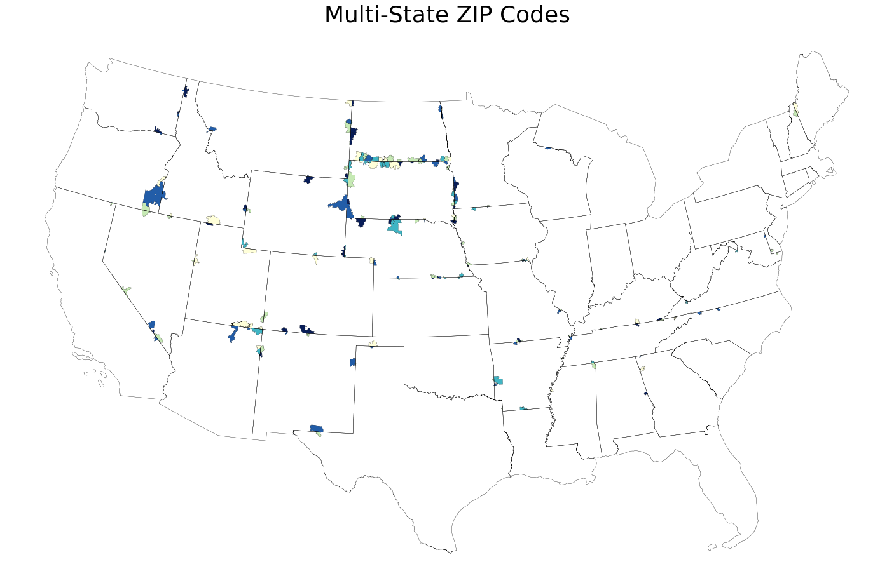

Why does this tool exist?
=========================

ZIP codes are ubiqitous in daily lives -- mailing packages, verifying your ZIP
code when using your credit card, using Google Maps, and so on. So you would
think that the Census Bureau (which conducts, of course, the Census, but also
supplemental surveys like the American Community Survey, or ACS) would report
its data on a ZIP code basis. And to some degree, it does. You can
`look up data <https://data.census.gov/cedsci/all?q=02906>`_ for any ZIP code
you would like right on the Census Bureau's website.

However, this published data is all aggregated. Sometimes, as researchers, we
want the microdata, which is the raw data collected from the ACS. However, by
federal law, the Census Bureau must `take precautions <https://www.census.gov/about/policies/privacy/statistical_safeguards.html>`_
to avoid publishing potentially identifying information for 72 years after data
collection. So while they do helpfully publish microdata from the ACS, they
do not identify the ZIP code of the respondent. This is because some ZIP codes
are extremely small -- 05141, for example, represents Cambridgeport, Vermont,
a town of only 112 people! And since the American Community Survey literally
collects every piece of demographic information you can imagine (ancestry, how
many cars you have, what kind of broadband you have, etc.) it wouldn't be too
hard to figure out exactly the identity of a respondent.

The other reason the Census Bureau doesn't publish data on a ZIP code basis is
that ZIP codes actually are not geographical areas -- they represent mail routes.
They've sort of been retooled and misused for geographic areas, the same way
Social Security numbers have ended up being used as federal identifiers despite
that not at all being the intention. Because of this, ZIP codes aren't quite as
geographically clean as we think they are. For example, some ZIP codes refer not
to locations but mail routes -- 02912, for example, simply represents Brown
University's central mail room from which mail is distributed across the
university by Brown itself and not the postal service. And some ZIP codes even
span multiple states, as shown below!

For both of the above reasons, the Census Bureau publishes microdata not by
ZIP code, but by Public Use Microdata Areas, commonly known as PUMAs. These
are actual geographic regions that are designed to have 100,000 residents each,
which the Census Bureau deems large enough to main anonymity. That means that we
can obtain approximate microdata data for a ZIP code by querying its PUMA --
should be easy, right?

Well, not quite. As we discussed before, ZIP codes are not geographic areas, but
mail routes, so it's not like there's a one-to-one conversion between PUMA
and ZIP. Thankfully, the U.S. Department of Housing and Urban Development (HUD)
publishes the `HUD-USPS ZIP Code Crosswalk <https://www.huduser.gov/portal/datasets/usps_crosswalk.html>`_
which allows us to convert ZIP codes to census tracts. This is good because we
now have actual geographical boundaries for a given ZIP code, but census tracts
are distinct from PUMAs and again are not 1:1 related. That means the final step
is computing the geographical intersection between census tracts and PUMA using
shape files provided by the Census Bureau. At this point, we can query approximate
data by ZIP code from the American Community Survey.

So, in summary, what does this tool actually do? It works through these messy
geographical conversions (ZIP -> census tract -> PUMA) to pull out approximate
data from the ACS on a ZIP code level, all without you having to think about
this geographical weirdness.
